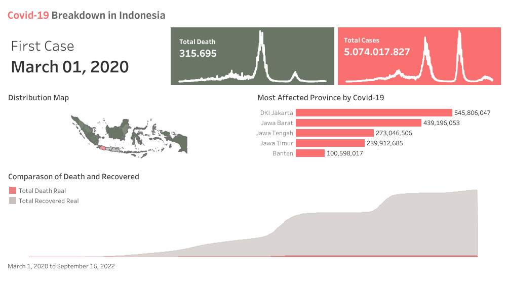
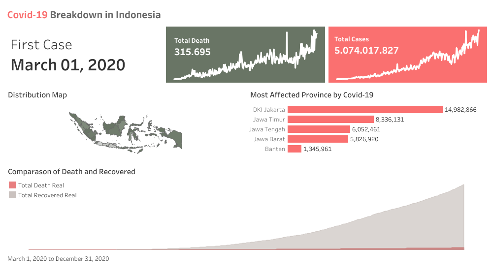
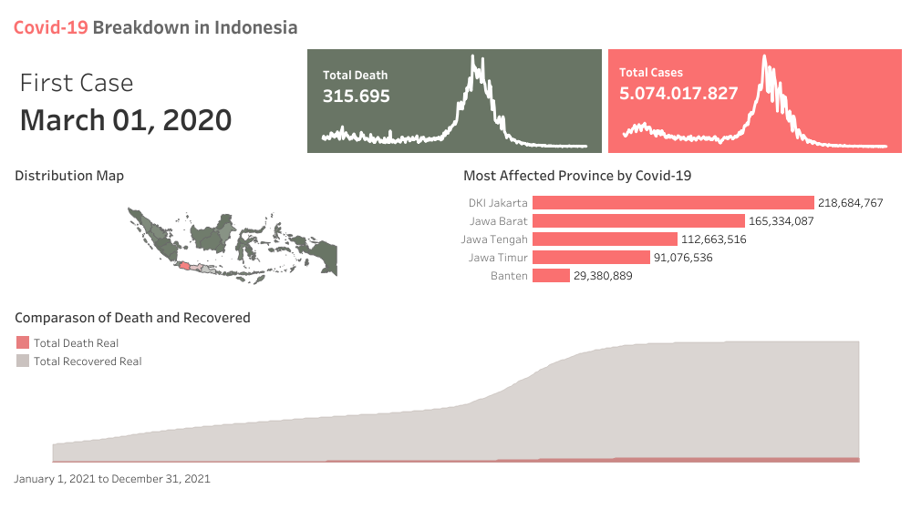
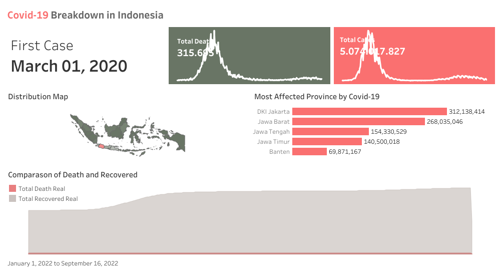

# Covid19-Dashboard
## Preview

---

---

---

---
[Live Dashboard](https://public.tableau.com/app/profile/danendra.sajana/viz/covidsetengahjadi/Dashboard4)

## Introduction
This project focuses on analyzing the distribution of COVID-19 data in Indonesia. The dataset used for this analysis, titled "COVID-19 Indonesia Dataset," was sourced from Kaggle and published by Hendratno in 2023. The analysis provides six key insights:
- Total number of deaths
- Total number of cases
- New cases
- Map distribution of new cases and total deaths
- Most affected provinces
- Comparison of death and recovery rates across the region

## Dataset Overview
The [dataset](https://www.kaggle.com/datasets/hendratno/covid19-indonesia) contains 3,493 rows with 38 columns, but the ones I used are: 
- **Date**: Daily record of cases and deaths.
- **Province**: Regional breakdown of data.
- **New Cases**: Daily number of confirmed cases.
- **Total Cases**: Cumulative count of confirmed cases.
- **New Deaths**: Daily number of reported deaths.
- **Total Deaths**: Cumulative count of deaths.
- **Recoveries**: Total number of recovered cases

Preprocessing of the dataset is done by removing all rows that contain null or missing values. This step is taken to ensure the integrity of the data used in the analysis is more optimal, so that the results of data visualization in Tableau can be presented accurately and without interference due to data anomalies. Thus, the analysis carried out becomes more credible and provides clearer and more reliable insights for decision making.

